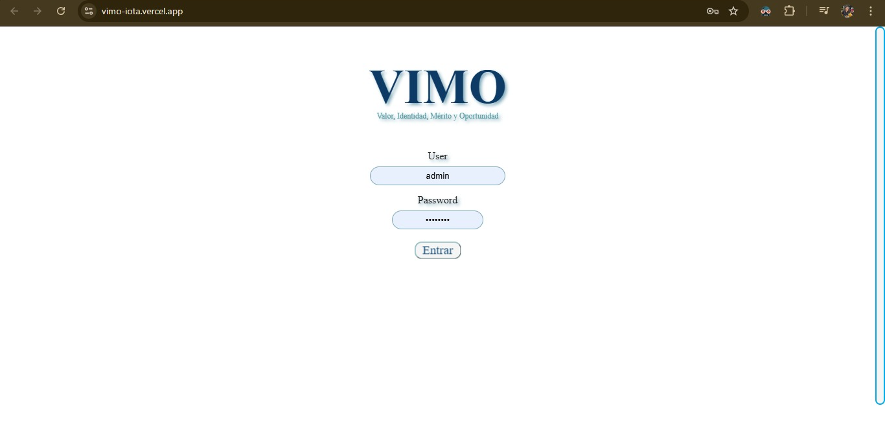
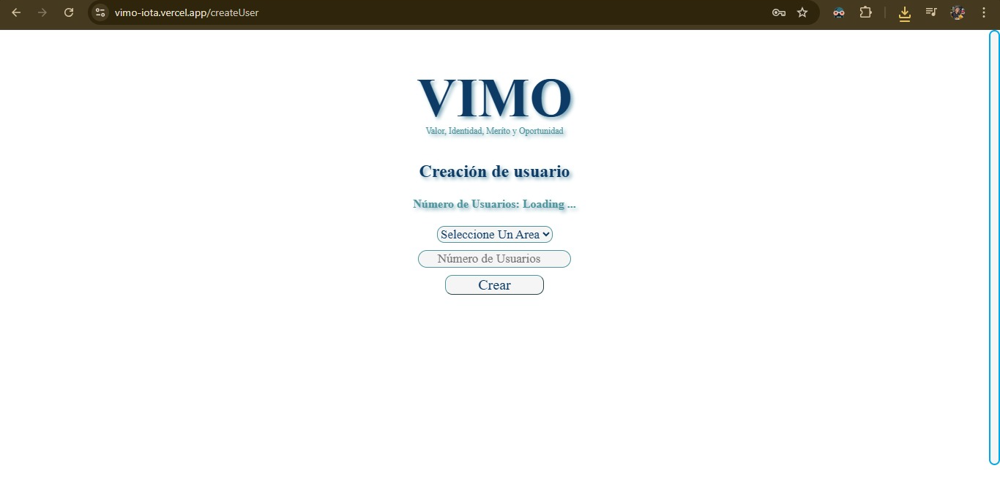
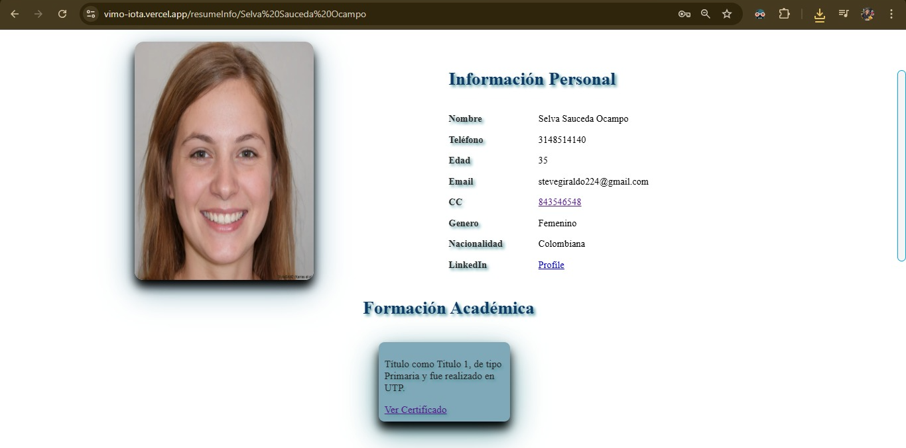
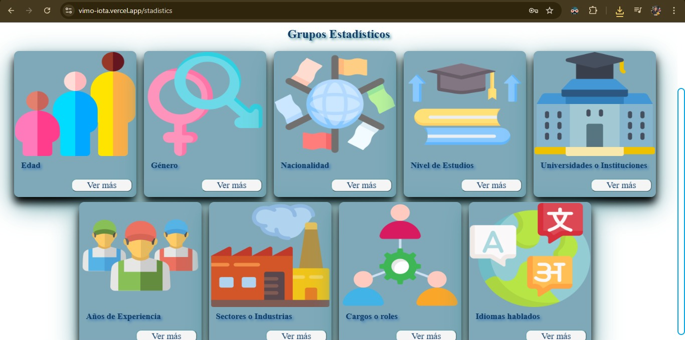
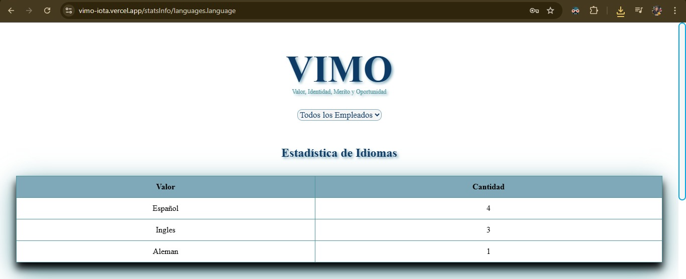
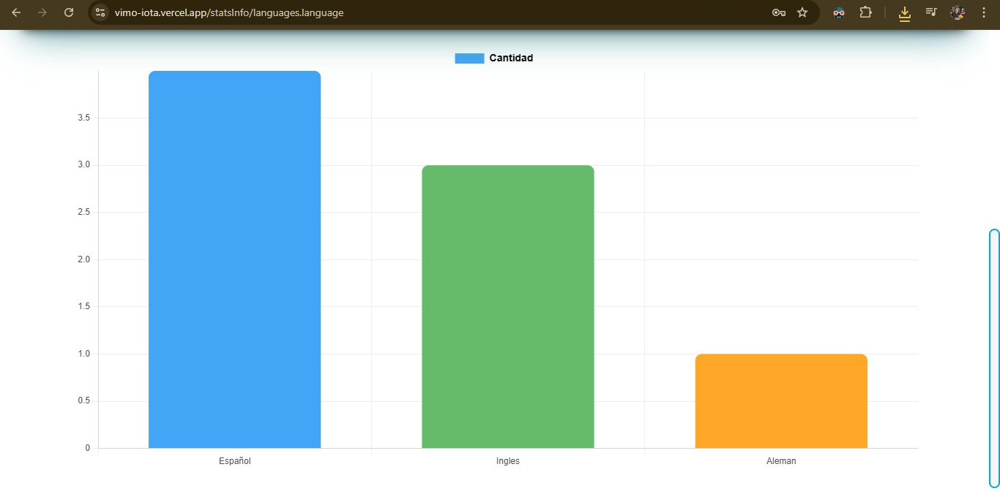

# 📄 Resume Management & Statistics System for Companies

A comprehensive **resume management platform** designed to **streamline hiring processes** and provide **actionable insights** through an integrated **statistical reporting system**. The platform features an **intuitive interface** for companies to upload, review, and analyze candidate resumes efficiently.

---
## Test Features

- To sign like an admin
user: admin; password: test2025

- To sign like an employee
user: employee1; password: test2025

## 🧑‍💼 Company Portal Features

- Upload and manage candidate resumes with ease  
- Search, filter, and sort resumes by skills, experience, and education  
- View detailed candidate profiles  
- Generate statistical reports on recruitment data  
- Visualize hiring trends and success rates using tables and charts  

---

## 🛠️ Technologies Used

- **Node.js** / **Express** (Backend)  
- **MongoDB** (Database)  
- **Angular** (Frontend UI)
- **Vercel** (Frontend Server)
- **Koyeb** (Backend Server)

---

## 📊 Why This Matters

Recruitment can be complex and time-consuming. This system empowers companies to **make data-driven hiring decisions** by combining efficient resume management with **insightful statistics**, helping HR teams **identify trends** and **optimize recruitment strategies**.

---

## 🚀 Getting Started

1. Clone the repository  
2. Install dependencies with `npm install`  
3. Configure environment variables for database and server connection  
4. Start backend server with `npm run start:backend`  
5. Start frontend server with `npm run start:frontend`  
6. Access the system via the web interface on your local machine  

---

## 📦 “Empowering talent acquisition with clarity and data-driven insights.”

## Interface Images

